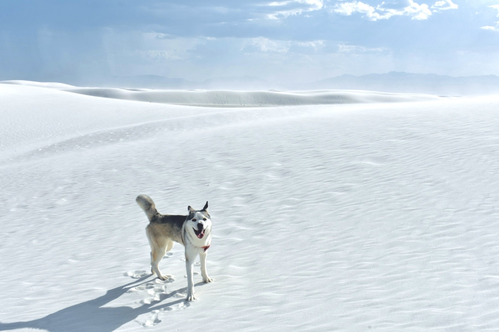

## Nemo

Born March 1, 2022. Best road trip co-pilot. Husky with opinions.

<div style="margin-top: 20px; text-align: center;">

</div>

<hr class="section-divider">

## Road Trips

### Irvine to Atlanta via Route 66

*13 days | 3,930 miles | 8 states | 5 national parks | with Nemo*

```{r, echo=FALSE, message=FALSE, warning=FALSE, fig.height=5}
library(plotly)

route <- data.frame(
  city = c("Irvine, CA", "Barstow, CA", "Kingman, AZ",
           "Grand Canyon NP", "Petrified Forest NP",
           "Albuquerque, NM", "Santa Fe, NM",
           "White Sands NP", "Amarillo, TX", "Oklahoma City, OK",
           "Hot Springs NP, AR", "Little Rock, AR",
           "Memphis, TN", "Nashville, TN",
           "Great Smoky Mountains NP", "Atlanta, GA"),
  lat = c(33.68, 34.90, 35.19, 36.06, 34.82,
          35.08, 35.69, 32.79,
          35.22, 35.47,
          34.52, 34.75, 35.15, 36.16,
          35.61, 33.75),
  lon = c(-117.83, -117.02, -114.05, -112.14, -109.89,
          -106.65, -105.94, -106.33,
          -101.83, -97.52,
          -93.05, -92.29, -90.05, -86.78,
          -83.43, -84.39),
  day = c(1, 1, 2, 3, 4, 5, 5, 6, 7, 8, 9, 9, 10, 11, 12, 13),
  type = c("Start", "Stop", "Stop",
           "National Park", "National Park",
           "Stop", "Stop", "National Park",
           "Stop", "Stop",
           "National Park", "Stop", "Stop", "Stop",
           "National Park", "End"),
  stringsAsFactors = FALSE
)

colors <- ifelse(route$type == "National Park", "#2ECC71",
          ifelse(route$type %in% c("Start", "End"), "#E74C3C", "#2C3E50"))
sizes <- ifelse(route$type == "National Park", 12,
         ifelse(route$type %in% c("Start", "End"), 14, 7))

geo_opts <- list(
  scope = "usa",
  projection = list(type = "albers usa"),
  showland = TRUE, landcolor = toRGB("gray95"),
  showlakes = TRUE, lakecolor = toRGB("white"),
  subunitwidth = 1, subunitcolor = toRGB("gray85"),
  countrywidth = 1, countrycolor = toRGB("gray85")
)

p <- plot_geo() %>%
  add_trace(data = route, lat = ~lat, lon = ~lon,
            mode = "lines", line = list(color = "#2C3E50", width = 2),
            showlegend = FALSE, hoverinfo = "none") %>%
  add_trace(data = route, lat = ~lat, lon = ~lon,
            mode = "markers",
            marker = list(color = colors, size = sizes,
                          line = list(color = "#fff", width = 1)),
            text = ~paste0("<b>Day ", day, ": ", city, "</b><br>", type),
            hoverinfo = "text", showlegend = FALSE) %>%
  layout(
    title = list(text = "Irvine -> Atlanta via Route 66",
                 font = list(color = "#2C3E50", size = 16)),
    geo = geo_opts,
    margin = list(t = 50, b = 0, l = 0, r = 0)
  ) %>%
  config(displayModeBar = FALSE)

p
```

<p class="map-legend">
<span style="color: #E74C3C;">&#9679;</span> Start/End &nbsp;
<span style="color: #2ECC71;">&#9679;</span> National Park &nbsp;
<span style="color: #2C3E50;">&#9679;</span> Stop
</p>

<div class="row" style="margin-top: 15px; margin-bottom: 25px;">
<div class="col-sm-3">
<div class="stat-card">
<span class="stat-number" style="color: #2C3E50;">13</span>
<span class="stat-label">Days</span>
</div>
</div>
<div class="col-sm-3">
<div class="stat-card">
<span class="stat-number" style="color: #3498DB;">3,930</span>
<span class="stat-label">Miles</span>
</div>
</div>
<div class="col-sm-3">
<div class="stat-card">
<span class="stat-number" style="color: #E74C3C;">8</span>
<span class="stat-label">States</span>
</div>
</div>
<div class="col-sm-3">
<div class="stat-card">
<span class="stat-number" style="color: #2ECC71;">5</span>
<span class="stat-label">National Parks</span>
</div>
</div>
</div>

### Pacific Coast Highway (Route 1)

*Aug 30 -- Sep 4, 2022 | Davis to Los Angeles via Route 1 with Nemo*

```{r, echo=FALSE, message=FALSE, warning=FALSE, fig.height=6}
library(plotly)

pch <- data.frame(
  stop = c("Start: Davis", "SF Twin Peaks", "Fisherman's Wharf",
           "Half Moon Bay", "Pigeon Point Lighthouse",
           "Monterey Aquarium", "Bixby Bridge",
           "Big Sur", "Pfeiffer Beach",
           "San Luis Obispo", "Santa Barbara",
           "End: Los Angeles"),
  lat = c(38.54, 37.7516, 37.8080, 37.4636, 37.1828,
          36.6185, 36.3714, 36.2704, 36.2383,
          35.2828, 34.4208, 34.0522),
  lon = c(-121.74, -122.4477, -122.4159, -122.4286, -122.3940,
          -121.9018, -121.9022, -121.8074, -121.8153,
          -120.6596, -119.6982, -118.2437),
  day = c(1, 1, 1, 2, 2, 3, 4, 4, 4, 5, 5, 6),
  type = c("Start", "Highlight", "Landmark", "Landmark", "Landmark",
           "Highlight", "Highlight", "Highlight", "Landmark",
           "Landmark", "Landmark", "End"),
  stringsAsFactors = FALSE
)

pch_colors <- ifelse(pch$type == "Highlight", "#3498DB",
              ifelse(pch$type %in% c("Start", "End"), "#E74C3C", "#2C3E50"))
pch_sizes <- ifelse(pch$type == "Highlight", 12,
             ifelse(pch$type %in% c("Start", "End"), 14, 8))

# Reference cities for geographic context
ref <- data.frame(
  name = c("Sacramento", "San Jose", "Fresno", "Bakersfield", "Los Angeles"),
  lat = c(38.58, 37.34, 36.74, 35.37, 33.93),
  lon = c(-121.20, -121.60, -119.79, -118.80, -117.90)
)

geo_ca <- list(
  resolution = 50,
  showland = TRUE, landcolor = toRGB("gray95"),
  showlakes = TRUE, lakecolor = toRGB("white"),
  showsubunits = TRUE, subunitcolor = toRGB("gray85"),
  showcountries = TRUE, countrycolor = toRGB("gray85"),
  showcoastlines = TRUE, coastlinecolor = toRGB("gray75"),
  lonaxis = list(range = c(-124, -117)),
  lataxis = list(range = c(33.5, 39)),
  bgcolor = "rgba(0,0,0,0)"
)

p2 <- plot_geo() %>%
  add_trace(data = ref, lat = ~lat, lon = ~lon,
            mode = "text", text = ~name,
            textfont = list(size = 10, color = "#bbb"),
            textposition = "middle right",
            showlegend = FALSE, hoverinfo = "none") %>%
  add_trace(data = pch, lat = ~lat, lon = ~lon,
            mode = "lines", line = list(color = "#3498DB", width = 3),
            showlegend = FALSE, hoverinfo = "none") %>%
  add_trace(data = pch, lat = ~lat, lon = ~lon,
            mode = "markers",
            marker = list(color = pch_colors, size = pch_sizes,
                          line = list(color = "#fff", width = 1)),
            text = ~paste0("<b>Day ", day, ": ", stop, "</b>"),
            hoverinfo = "text", showlegend = FALSE) %>%
  layout(
    title = list(text = "Davis -> Los Angeles via Route 1 | Aug 30 - Sep 4, 2022",
                 font = list(color = "#3498DB", size = 16)),
    geo = geo_ca,
    margin = list(t = 50, b = 0, l = 0, r = 0)
  ) %>%
  config(displayModeBar = FALSE)

p2
```

<p class="map-legend">
<span style="color: #E74C3C;">&#9679;</span> Start/End &nbsp;
<span style="color: #3498DB;">&#9679;</span> Highlight &nbsp;
<span style="color: #2C3E50;">&#9679;</span> Landmark
</p>

### Davis to Kansas & Back

*10 days | 3,339 miles | 6 states | Round trip across the plains & Rockies | with Nemo*

```{r, echo=FALSE, message=FALSE, warning=FALSE, fig.height=5}
library(plotly)

dk <- data.frame(
  city = c("Davis, CA", "Flagstaff, AZ", "Albuquerque, NM",
           "Amarillo, TX", "Oklahoma City, OK", "Wichita, KS",
           "Hutchinson, KS", "Denver, CO", "Grand Junction, CO",
           "Moab, UT", "Salt Lake City, UT", "Reno, NV", "Davis, CA"),
  lat = c(38.54, 35.20, 35.08, 35.22, 35.47, 37.69,
          38.06, 39.74, 39.06, 38.57, 40.76, 39.53, 38.54),
  lon = c(-121.74, -111.65, -106.65, -101.83, -97.52, -97.34,
          -97.93, -104.99, -108.55, -109.55, -111.89, -119.81, -121.74),
  day = c(1, 2, 3, 4, 5, 6, 6, 7, 8, 8, 9, 9, 10),
  type = c("Start", "Stop", "Stop", "Stop", "Stop", "Stop",
           "Museum", "Stop", "Stop", "Stop", "Stop", "Stop", "End"),
  stringsAsFactors = FALSE
)

dk_colors <- ifelse(dk$type == "Museum", "#E67E22",
             ifelse(dk$type %in% c("Start", "End"), "#E74C3C", "#2C3E50"))
dk_sizes <- ifelse(dk$type == "Museum", 12,
            ifelse(dk$type %in% c("Start", "End"), 14, 7))

geo_dk <- list(
  scope = "usa",
  projection = list(type = "albers usa"),
  showland = TRUE, landcolor = toRGB("gray95"),
  showlakes = TRUE, lakecolor = toRGB("white"),
  subunitwidth = 1, subunitcolor = toRGB("gray85"),
  countrywidth = 1, countrycolor = toRGB("gray85")
)

p3 <- plot_geo() %>%
  add_trace(data = dk, lat = ~lat, lon = ~lon,
            mode = "lines", line = list(color = "#2C3E50", width = 2),
            showlegend = FALSE, hoverinfo = "none") %>%
  add_trace(data = dk, lat = ~lat, lon = ~lon,
            mode = "markers",
            marker = list(color = dk_colors, size = dk_sizes,
                          line = list(color = "#fff", width = 1)),
            text = ~paste0("<b>Day ", day, ": ", city, "</b><br>", type),
            hoverinfo = "text", showlegend = FALSE) %>%
  layout(
    title = list(text = "Davis <-> Kansas | Round Trip",
                 font = list(color = "#2C3E50", size = 16)),
    geo = geo_dk,
    margin = list(t = 50, b = 0, l = 0, r = 0)
  ) %>%
  config(displayModeBar = FALSE)

p3
```

<p class="map-legend">
<span style="color: #E74C3C;">&#9679;</span> Start/End &nbsp;
<span style="color: #E67E22;">&#9679;</span> Museum &nbsp;
<span style="color: #2C3E50;">&#9679;</span> Stop
</p>

<div class="row" style="margin-top: 15px; margin-bottom: 25px;">
<div class="col-sm-3">
<div class="stat-card">
<span class="stat-number" style="color: #2C3E50;">10</span>
<span class="stat-label">Days</span>
</div>
</div>
<div class="col-sm-3">
<div class="stat-card">
<span class="stat-number" style="color: #3498DB;">3,339</span>
<span class="stat-label">Miles</span>
</div>
</div>
<div class="col-sm-3">
<div class="stat-card">
<span class="stat-number" style="color: #E74C3C;">6</span>
<span class="stat-label">States</span>
</div>
</div>
<div class="col-sm-3">
<div class="stat-card">
<span class="stat-number" style="color: #E67E22;">1</span>
<span class="stat-label">Museum</span>
</div>
</div>
</div>

<hr class="section-divider">

## McDonald's Enthusiast

*~250 visits across 7 years in the US (2019--2026). Estimates based on deeply personal experience.*

```{r, echo=FALSE, message=FALSE, warning=FALSE, fig.height=5}
library(plotly)

mcdata <- data.frame(
  item = c("Fries", "McNuggets", "Ice Cream Cone", "McChicken",
           "Filet-O-Fish", "McFlurry", "Chicken Strips", "Big Mac",
           "Drinks", "Breakfast"),
  count = c(220, 130, 90, 55, 50, 20, 18, 12, 20, 5),
  stringsAsFactors = FALSE
)

p <- plot_ly(
  type = "treemap",
  labels = ~paste0(mcdata$item, "\n", mcdata$count),
  parents = rep("", nrow(mcdata)),
  values = mcdata$count,
  textinfo = "label",
  textfont = list(size = 14),
  marker = list(
    colors = c("#FFCC00", "#FFA500", "#FFE4B5", "#DA291C",
               "#FF6347", "#FFC0CB", "#FF8C00", "#CD853F",
               "#8B4513", "#D2691E"),
    line = list(color = "#fff", width = 2)
  ),
  hoverinfo = "label+value+percent parent",
  hovertemplate = "<b>%{label}</b><br>%{value} orders<br>%{percentParent:.1%} of total<extra></extra>"
) %>%
  layout(
    title = list(text = "Estimated Lifetime Orders (~250 visits)",
                 font = list(color = "#DA291C", size = 16)),
    margin = list(t = 50, b = 10, l = 10, r = 10)
  ) %>%
  config(displayModeBar = FALSE)

p
```

### The Fries Equation

*The deliciousness of McDonald's fries follows an exponential decay model. Peak flavor at t=0, critically degraded by t=5 min.*

```{r, echo=FALSE, message=FALSE, warning=FALSE, fig.height=4}
library(plotly)

t <- seq(0, 30, by = 0.5)
deliciousness <- 100 * exp(-0.25 * t)

fries <- data.frame(time = t, yum = deliciousness)

p2 <- plot_ly(fries, x = ~time, y = ~yum, type = "scatter", mode = "lines",
  line = list(color = "#FFCC00", width = 3),
  hoverinfo = "text",
  text = ~paste0(round(yum, 0), "% delicious at ", time, " min")
) %>%
  add_annotations(x = 0, y = 100, text = "Peak Flavor",
                  showarrow = TRUE, arrowcolor = "#333",
                  font = list(color = "#2C3E50", size = 12),
                  ax = 50, ay = -20) %>%
  add_annotations(x = 5, y = 100 * exp(-0.25 * 5), text = "Must finish!",
                  showarrow = TRUE, arrowcolor = "#333",
                  font = list(color = "#E74C3C", size = 12),
                  ax = -50, ay = -25) %>%
  add_annotations(x = 5.02, y = 100 * exp(-0.25 * 5.02), text = "Sad fries >>",
                  showarrow = FALSE,
                  font = list(color = "#E67E22", size = 11),
                  xanchor = "left", yanchor = "top") %>%
  add_annotations(x = 15, y = 100 * exp(-0.25 * 15), text = "Even Nemo won't touch these",
                  showarrow = TRUE, arrowcolor = "#333",
                  font = list(color = "#7F8C8D", size = 11),
                  ax = 80, ay = -20) %>%
  add_segments(x = 5, xend = 5, y = 0, yend = 100 * exp(-0.25 * 5),
               line = list(color = "#E74C3C", width = 1, dash = "dash"),
               showlegend = FALSE, hoverinfo = "none") %>%
  layout(
    title = list(text = "Fries Deliciousness ~ exp(-0.25t)",
                 font = list(color = "#DA291C", size = 15)),
    xaxis = list(title = "Time Since Pickup (min)",
                 titlefont = list(color = "#333"),
                 tickfont = list(color = "#333"), gridcolor = "#eee"),
    yaxis = list(title = "Deliciousness (%)",
                 titlefont = list(color = "#333"),
                 tickfont = list(color = "#333"), gridcolor = "#eee",
                 range = c(0, 110)),
    plot_bgcolor = "rgba(0,0,0,0)",
    paper_bgcolor = "rgba(0,0,0,0)",
    margin = list(t = 50, b = 50)
  ) %>%
  config(displayModeBar = FALSE)

p2
```
